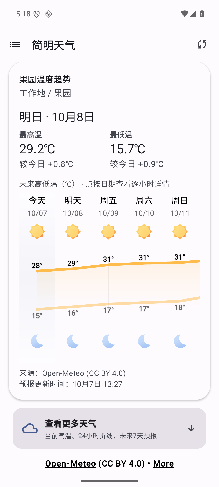
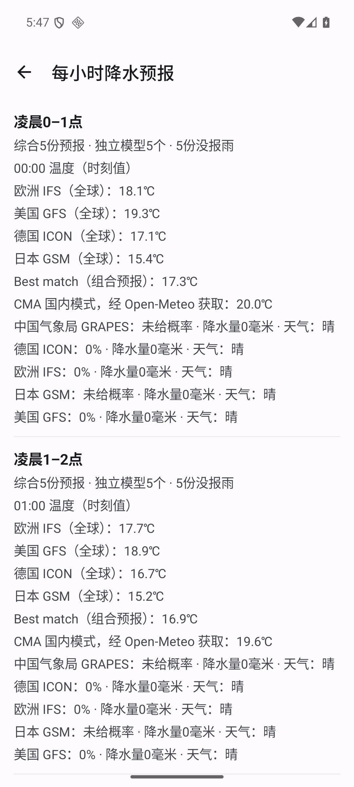

# 家庭天气（简明天气）

基于 Breezy Weather 修改的 Android 家庭天气应用，面向长辈查看城市与果园预报，并观看中国天气网联播天气节目。这个家庭定制版本与上游应用不同；上游下载链接和签名不适用于本项目安装包。

**状态：暂停开发，保留未来继续。** 截至2026年10月8日，已有可安装的ARM64版本及源码恢复材料。功能仍有未完成部分，尤其**首页易用性尚未满足使用者要求**，不能把本次封存理解为产品整体验收通过。暂停期间不新增功能、自动试验或发布新版本。

## 目前可以做什么

- 选择城市查看天气；“工作地／果园”有独立默认地点和删除保护。选中果园时显示果园降雨、温度卡，其他城市不借用果园或桂林数据。
- 查看今天／明天最高、最低温与各自变化，以及未来高低温趋势。使用真实预报数据、地点时区、中文日期与℃；缺数据不填0，过去的预报不冒充过去实况。
- 在逐小时预报或“来源详情”里对照不同模式的温度和降水，查看来源、时间和缺失字段。温度是指定时刻值；降水量是标注时段的累计值，不把两者当同一个时间定义，也不把各模式简单平均。
- 查看“CMA 国内模式，经 Open-Meteo 获取”与国际模式的对照。CMA约15公里网格，原生3小时数据插值为逐小时值；它不是果园实测，也不是新增独立国内直连通道。两类模式共享Open-Meteo网关，分别请求与处理失败。
- 获取时间与发布时间分别显示；没有发布时间就写“未提供”。天气证据缓存保留原获取时间和模式身份，重启不会把旧结果伪装成新刷新。
- 观看天气节目，使用已有字幕与回看入口。手机端准备采用SenseVoice，保留共享准备任务、安全取消、缓存隔离及识别明确失败后的Vosk回退；V6要点与原句／待核区分开展示。无需电脑常驻服务，也不默认调用大语言模型。

这些功能有既有构建、模拟器播放和天气链路记录，但不保证所有网络环境、所有设备或所有预报内容都可靠。

## 实际页面

以下为2026年10月7日本次模拟器运行时由主代理截取的页面，不是设计稿。左图是已有果园温度候选，右图是最新天气封存包；[截图来源与版本说明](docs/screenshots/README.md)保留具体边界。没有公开果园坐标或返回网格中心。**首页易用性仍未达标**，图片仅展示已有成果。

<table>
  <tr>
    <th>果园温度与未来趋势</th>
    <th>不同模式逐小时对照</th>
  </tr>
  <tr>
    <td></td>
    <td></td>
  </tr>
</table>

## 怎样安装与使用

封存包名为 `com.family.weather.sensevoice`，Android 6.0（API23）及以上；已有封存版本是 **ARM64 basicDebug**，不是公开发布版本。本仓库不公开上传这个含私人地点的封存APK；其他使用者应按下文配置自己的地点后从源码构建。已有实际运行证据来自Mac ARM64模拟器，不等于各款手机都完成了验收。

从所有者的私有恢复材料取得 `app-basic-arm64-v8a-debug.apk`，先核对校验清单，再按设备正常安装流程安装。若已有同包名且签名一致的版本，可覆盖安装；签名冲突时先保留数据并查明原因，不能为安装而卸载、清空数据。上游Breezy Weather安装包不能替代此包。

已封存APK：`6.2.2-r6290-sv4`／`60210`，SHA256：

```text
ea70053705b2a9bdbad43747c89821b57dce0c246da0cb0de1dec0bb69b82686
```

打开应用，选择工作地／果园或所需城市；从今天／明天的小时预报进入“来源详情”。“来源与更新时间”可展开查看网格、获取时间与未提供的发布时间。无网络或来源失败时，注意页面的失败／旧缓存提示，不把“未提供”当作没雨。

和风天气保持未配置，需要自行取得合法账户、Key、Host与相应额度后才能使用；本次没有新增账户、密钥或付费服务。小米／中国源只在选中对应来源、坐标匹配等条件下显示已有缓存参考，本次没有验到符合条件的实际缓存，不能凑成新的独立来源。中国天气网视频也不是逐小时预报源。

## 没做完与已知问题

- **首页易用性仍未达标。** 果园温度和多源链路有成果，但信息排列、重点表达和长辈使用体验仍需以后继续设计，不能仅凭功能入口存在就写“已完成”。
- **sv4 ASR内容质量仍未通过。** 连续城市报数会丢地名、天气、温度下限；一些裁切恢复词语，也可能产生错误否定。已核哈尔滨“多云4–15℃”、雪花“局地可能会”、福州／南宁“五号到七号、下半年首次最低低于20℃”仅作为有限回归依据，不代表整片准确。其余识别冲突待核，不补猜、不用摘要润色当真值，也不再要求使用者承担听核。
- 生产分窗未整体替换为短窗，未新增模型。字幕和摘要可能有误；准备流程存在不代表完整推理与内容质量都通过。本轮收尾没有重跑完整准备或模型推理。
- **TLS／ANR问题未解决。** 模拟器首轮出现TLS连接关闭及一次输入超时ANR，之后重启本App可取得真实天气并查看页面，但根因尚未确认；不保证长期稳定。已有可选反向地理编码也有失败记录，果园回退路径不能证明所有城市同样可用。
- CMA与国际模式共享网关；网格预报不等于果园实况。没有独立国内直连来源的稳定性或准确性证明；和风未配置、小米实际缓存链路未验。
- Windows最新未提交差异仍暂缓且未核，不能写成与Mac完全一致。原目录、工作树、分支和历史交付继续保留。

## 地点隐私

当前受版本管理的源码不保存果园及其县城参考点的实际经纬度；个人路径、私人下载链接和测试中的地点日志已做脱敏，详细边界见[源码隐私说明](docs/SOURCE_PRIVACY.md)。实际地点定义仅在本机Git忽略的 `domain/src/main/kotlin/org/breezyweather/domain/multisource/location/LocationAuthority.kt` 中；仓库只提供无坐标的 `.kt.example` 模板。测试中的固定数字是无关的示例坐标，不能当作果园位置。README截图不包含经纬度或返回网格中心。

从源码构建前，复制 `LocationAuthority.kt.example` 为同目录 `LocationAuthority.kt`，替换四个 `PRIVATE_*` 占位符为你自己的地点坐标，并保持生成的文件不入库。不得用0、桂林或其他城市代填缺失的果园坐标。已有本机配置原样保留；若没有配置，源码不能直接构建。这是隐私所需配置步骤，本次未追加界面功能。

公开地址保持 `suifracti/family-weather`。为隔离旧私人地点历史，按所有者授权同名重建，公开历史从脱敏源码快照开始；GitHub仓库身份会改变，旧分支、标签和完整历史仅在本机私有备份中恢复，不再上传。重建后先保持私有，核验旧隐私对象无法访问，再公开。原APK包含私人地点常量，完整恢复包与历史bundle也只供所有者使用，不能当作已脱敏公开制品。实际配置、模型、原始证据和用户缓存均保持私有。

## 怎样恢复或以后继续

私有收尾材料保存本地提交SHA、Git bundle、源码归档、可安装APK、校验清单、未入库清单和恢复说明。只在全新目录恢复，先验证SHA256；不覆盖当前目录、不重置工作树、不清个人设置、字幕缓存或手动资料。原始证据、模型和运行数据库不在Git中。

先复制 `LocationAuthority.kt.example` 为同目录 `LocationAuthority.kt` 并填写自己的地点；按配置模板设置SDK路径，和风等可选凭据可留空。构建需要JDK17、仓库Gradle wrapper、Android SDK（compileSdk37、targetSdk36、Build Tools36.0.0）及固定非Git模型／原生依赖。可复用已有Mac环境，不能为了恢复改下载日期或模型版本。详细步骤见[开发与恢复入口](docs/DEVELOPMENT.md)、[暂停基线说明](docs/PAUSED_BASELINE.md)及[依赖清单](docs/migration/required-assets.json)。

```sh
# 所有者已有固定恢复包时，按包校验恢复
python3 tools/migration/restore_assets.py
# 没有私有包时，可从清单中的固定官方来源恢复相同依赖
# 首次下载约270 MB，恢复资产约342 MB；网络不可达时停止，不换版本
python3 tools/migration/download_assets.py
# local.properties按模板填本机SDK路径，凭据可留空
export JAVA_HOME=$(/usr/libexec/java_home -v 17)
./gradlew :app:assembleBasicDebug --console=plain
```

安装包在 `app/build/outputs/apk/basic/debug/app-basic-arm64-v8a-debug.apk`。这是以后恢复开发时使用的构建入口，本次暂停收尾不重新构建。版本后缀包含Git提交计数，因此以后重建的显示后缀可能不同；封存包以其实际哈希和对应源码清单为准。

以后继续前先读取未完清单，核对本地基线及未提交状态，另行确认新的开发范围。暂停不等于删除项目，也不意味着远端仓库被设为Archived。

## 来源与许可

保留[Breezy Weather上游说明与来源](docs/SOURCES.md)、[GNU LGPL v3许可证](LICENSE)及模型／原生运行库的来源和许可证。这个修改版不能冒充上游官方发布；源码许可不代表天气数据、模型或品牌没有各自使用条件。恢复材料保持私有，不公开上传原始证据、个人配置或密钥。
